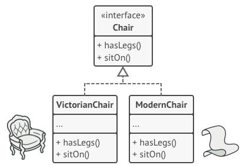
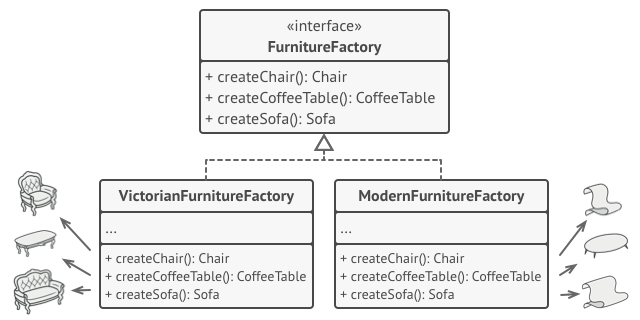
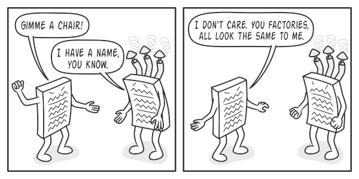
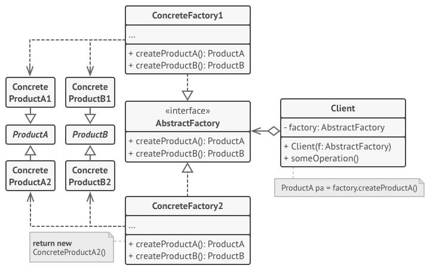
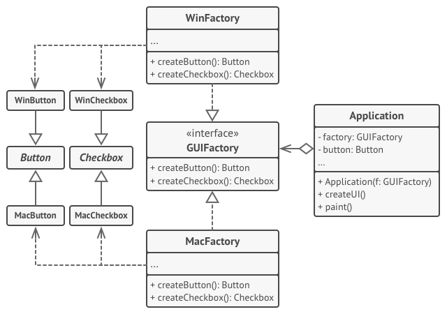

###### [Home](https://github.com/RyKaj/Documentation/blob/master/README.md) | [Software Development](https://github.com/RyKaj/Documentation/tree/master/SoftwareDevelopment/README.md) | [Design Patterns](https://github.com/RyKaj/Documentation/tree/master/SoftwareDevelopment/Design%20Patterns/README.md) |
------------

# Information Technology : Abstract Factory Pattern


## Abstract Factory

<kbd></kbd>

### Intent

**Abstract Factory** is a creational design pattern that lets you
produce families of related objects without specifying their concrete
classes.

<kbd></kbd>

### Problem

Imagine that you’re creating a furniture shop simulator. Your code
consists of classes that represent:

1.  A family of related products, say: `Chair` + `Sofa` + `CoffeeTable`.

2.  Several variants of this family. For example, products `Chair` +
    `Sofa` + `CoffeeTable` are available in these variants: `Modern`,
    `Victorian`, `ArtDeco`.

<kbd></kbd>

You need a way to create individual furniture objects so that they match
other objects of the same family. Customers get quite mad when they
receive non-matching furniture.

<kbd></kbd>

Also, you don’t want to change existing code when adding new products or
families of products to the program. Furniture vendors update their
catalogs very often, and you wouldn’t want to change the core code each
time it happens.

### Solution

The first thing the Abstract Factory pattern suggests is to explicitly
declare interfaces for each distinct product of the product family
(e.g., chair, sofa or coffee table). Then you can make all variants of
products follow those interfaces. For example, all chair variants can
implement the `Chair` interface; all coffee table variants can implement
the `CoffeeTable` interface, and so on.

<kbd></kbd>

The next move is to declare the *Abstract Factory*—an interface with a
list of creation methods for all products that are part of the product
family (for example, `createChair`, `createSofa` and
`createCoffeeTable`). These methods must return **abstract** product
types represented by the interfaces we extracted previously: `Chair`,
`Sofa`, `CoffeeTable` and so on.

<kbd></kbd>

Now, how about the product variants? For each variant of a product
family, we create a separate factory class based on the
`AbstractFactory` interface. A factory is a class that returns products
of a particular kind. For example, the `ModernFurnitureFactory` can only
create `ModernChair`, `ModernSofa` and `ModernCoffeeTable` objects.

The client code has to work with both factories and products via their
respective abstract interfaces. This lets you change the type of a
factory that you pass to the client code, as well as the product variant
that the client code receives, without breaking the actual client code.

<kbd></kbd>

Say the client wants a factory to produce a chair. The client doesn’t
have to be aware of the factory’s class, nor does it matter what kind of
chair it gets. Whether it’s a Modern model or a Victorian-style chair,
the client must treat all chairs in the same manner, using the abstract
`Chair` interface. With this approach, the only thing that the client
knows about the chair is that it implements the `sitOn` method in some
way. Also, whichever variant of the chair is returned, it’ll always
match the type of sofa or coffee table produced by the same factory
object.

There’s one more thing left to clarify: if the client is only exposed to
the abstract interfaces, what creates the actual factory objects?
Usually, the application creates a concrete factory object at the
initialization stage. Just before that, the app must select the factory
type depending on the configuration or the environment settings.

### Structure

<kbd></kbd>

### Pseudocode

This example illustrates how the **Abstract Factory** pattern can be
used for creating cross-platform UI elements without coupling the client
code to concrete UI classes, while keeping all created elements
consistent with a selected operating system.

<kbd></kbd>

The same UI elements in a cross-platform application are expected to
behave similarly, but look a little bit different under different
operating systems. Moreover, it’s your job to make sure that the UI
elements match the style of the current operating system. You wouldn’t
want your program to render macOS controls when it’s executed in
Windows.

The Abstract Factory interface declares a set of creation methods that
the client code can use to produce different types of UI elements.
Concrete factories correspond to specific operating systems and create
the UI elements that match that particular OS.

It works like this: when an application launches, it checks the type of
the current operating system. The app uses this information to create a
factory object from a class that matches the operating system. The rest
of the code uses this factory to create UI elements. This prevents the
wrong elements from being created.

With this approach, the client code doesn’t depend on concrete classes
of factories and UI elements as long as it works with these objects via
their abstract interfaces. This also lets the client code support other
factories or UI elements that you might add in the future.

As a result, you don’t need to modify the client code each time you add
a new variation of UI elements to your app. You just have to create a
new factory class that produces these elements and slightly modify the
app’s initialization code so it selects that class when appropriate.

### Real world example

Extending our door example from Simple Factory. Based on your needs you
might get a wooden door from a wooden door shop, iron door from an iron
shop or a PVC door from the relevant shop. Plus you might need a guy
with different kind of specialities to fit the door, for example a
carpenter for wooden door, welder for iron door etc. As you can see
there is a dependency between the doors now, wooden door needs
carpenter, iron door needs a welder etc.

### In plain words

A factory of factories; a factory that groups the individual but
related/dependent factories together without specifying their concrete
classes.

### Wikipedia says

The abstract factory pattern provides a way to encapsulate a group of
individual factories that have a common theme without specifying their
concrete classes

### Pros and Cons


<table>
    <thead>
        <tr class="header">
            <th>Pros</th>
            <th>Cons</th>
        </tr>
    </thead>
    <tbody>
        <tr class="odd">
            <td>You can be sure that the products you’re getting from a factory are compatible with each other.</td>
            <td>The code may become more complicated than it should be, since a lot of new interfaces and classes are introduced along with the pattern.</td>
        </tr>
        <tr class="even">
            <td>You avoid tight coupling between concrete products and client code.</td>
            <td><br /></td>
        </tr>
        <tr class="odd">
            <td>S<em>ingle Responsibility Principle</em>. You can extract the product creation code into one place, making the code easier to support.</td>
            <td><br /></td>
        </tr>
        <tr class="even">
            <td><em>Open/Closed Principle</em>. You can introduce new variants of products without breaking existing client code.</td>
            <td><br /></td>
        </tr>
    </tbody>
</table>


### Programmatic Example

Translating the door example above. First of all we have our `Door`
interface and some implementation for it

#### C\#


> 
> 
> ``` 
> interface IDoor {
>     void GetDescription();
> }
> class WoodenDoor : IDoor
> {
>     public void GetDescription()
>     {
>         Console.WriteLine("I am a wooden door");
>     }
> }
> 
> class IronDoor : IDoor
> {
>     public void GetDescription()
>     {
>         Console.WriteLine("I am a iron door");
>     }
> }
>                     
> ```

Then we have some fitting experts for each door type

> 
> 
> ``` 
> interface IDoorFittingExpert
> {
>     void GetDescription();
> }
> 
> class Welder : IDoorFittingExpert
> {
>     public void GetDescription()
>     {
>         Console.WriteLine("I can only fit iron doors");
>     }
> }
> 
> class Carpenter : IDoorFittingExpert
> {
>     public void GetDescription()
>     {
>         Console.WriteLine("I can only fit wooden doors");
>     }
> }
>                     
> ```

Now we have our abstract factory that would let us make family of
related objects i.e. wooden door factory would create a wooden door and
wooden door fitting expert and iron door factory would create an iron
door and iron door fitting expert

> 
> 
> ``` 
> interface IDoorFactory {
>     IDoor MakeDoor();
>     IDoorFittingExpert MakeFittingExpert();
> }
> 
> // Wooden factory to return carpenter and wooden door
> class WoodenDoorFactory : IDoorFactory
> {
>     public IDoor MakeDoor()
>     {
>         return new WoodenDoor();
>     }
> 
>     public IDoorFittingExpert MakeFittingExpert()
>     {
>         return new Carpenter();
>     }
> }
> 
> // Iron door factory to get iron door and the relevant fitting expert
> class IronDoorFactory : IDoorFactory
> {
>     public IDoor MakeDoor()
>     {
>         return new IronDoor();
>     }
> 
>     public IDoorFittingExpert MakeFittingExpert()
>     {
>         return new Welder();
>     }
> }
>                     
> ```

And then it can be used as

> 
> 
> ``` 
> var woodenDoorFactory = new WoodenDoorFactory();
> 
> var woodenDoor = woodenDoorFactory.MakeDoor();
> var woodenDoorFittingExpert = woodenDoorFactory.MakeFittingExpert();
> 
> woodenDoor.GetDescription(); //Output : I am a wooden door
> woodenDoorFittingExpert.GetDescription();//Output : I can only fit woooden doors
> 
> var ironDoorFactory = new IronDoorFactory();
> 
> var ironDoor = ironDoorFactory.MakeDoor();
> var ironDoorFittingExpert = ironDoorFactory.MakeFittingExpert();
> 
> ironDoor.GetDescription();//Output : I am a iron door
> ironDoorFittingExpert.GetDescription();//Output : I can only fit iron doors
>                     
> ```


#### Java


``` 
public interface Castle {
    String getDescription();
}
public interface King {
    String getDescription();
}
public interface Army {
    String getDescription();
}

// Elven implementations ->
public class ElfCastle implements Castle {
    static final String DESCRIPTION = "This is the Elven castle!";
    @Override
    public String getDescription() {
        return DESCRIPTION;
    }
}
public class ElfKing implements King {
    static final String DESCRIPTION = "This is the Elven king!";
    @Override
    public String getDescription() {
        return DESCRIPTION;
    }
}
public class ElfArmy implements Army {
    static final String DESCRIPTION = "This is the Elven Army!";
    @Override
    public String getDescription() {
        return DESCRIPTION;
    }
}

// Orcish implementations similarly...
                
```

Then we have the abstraction and implementations for the kingdom factory

``` 
public interface KingdomFactory {
    Castle createCastle();
    King createKing();
    Army createArmy();
}

public class ElfKingdomFactory implements KingdomFactory {
    public Castle createCastle() {
        return new ElfCastle();
    }
    public King createKing() {
        return new ElfKing();
    }
    public Army createArmy() {
        return new ElfArmy();
    }
}

public class OrcKingdomFactory implements KingdomFactory {
    public Castle createCastle() {
        return new OrcCastle();
    }
    public King createKing() {
        return new OrcKing();
    }
    public Army createArmy() {
        return new OrcArmy();
    }
}
                
```

Now we have our abstract factory that lets us make family of related
objects i.e. Elven kingdom factory creates Elven castle, king and army
etc.

``` 
KingdomFactory factory = new ElfKingdomFactory();
Castle castle = factory.createCastle();
King king = factory.createKing();
Army army = factory.createArmy();

castle.getDescription();  // Output: This is the Elven castle!
king.getDescription(); // Output: This is the Elven king!
army.getDescription(); // Output: This is the Elven Army!
                
```

Now, we can design a factory for our different kingdom factories. In
this example, we created FactoryMaker, responsible for returning an
instance of either ElfKingdomFactory or OrcKingdomFactory.  
The client can use FactoryMaker to create the desired concrete factory
which, in turn, will produce different concrete objects (Army, King,
Castle).  
In this example, we also used an enum to parameterize which type of
kingdom factory the client will ask for.

``` 
public static class FactoryMaker {
    public enum KingdomType {
        ELF, ORC
    }

    public static KingdomFactory makeFactory(KingdomType type) {
                switch (type) {
                    case ELF:
                        return new ElfKingdomFactory();
                    case ORC:
                        return new OrcKingdomFactory();
                    default:
                        throw new IllegalArgumentException("KingdomType not supported.");
            }
        }
}

public static void main(String[] args) {
    App app = new App();

    LOGGER.info("Elf Kingdom");
    app.createKingdom(FactoryMaker.makeFactory(KingdomType.ELF));
    LOGGER.info(app.getArmy().getDescription());
    LOGGER.info(app.getCastle().getDescription());
    LOGGER.info(app.getKing().getDescription());

    LOGGER.info("Orc Kingdom");
    app.createKingdom(FactoryMaker.makeFactory(KingdomType.ORC));
    -- similar use of the orc factory
}
                
```


#### PHP


``` 
interface Door
{
    public function getDescription();
}

class WoodenDoor implements Door
{
    public function getDescription()
    {
        echo 'I am a wooden door';
    }
}

class IronDoor implements Door
{
    public function getDescription()
    {
        echo 'I am an iron door';
    }
}
                
```

  

Then we have some fitting experts for each door type

``` 
interface DoorFittingExpert
{
    public function getDescription();
}

class Welder implements DoorFittingExpert
{
    public function getDescription()
    {
        echo 'I can only fit iron doors';
    }
}

class Carpenter implements DoorFittingExpert
{
    public function getDescription()
    {
        echo 'I can only fit wooden doors';
    }
}
                
```

Now we have our abstract factory that would let us make family of
related objects i.e. wooden door factory would create a wooden door and
wooden door fitting expert and iron door factory would create an iron
door and iron door fitting expert

``` 
interface DoorFactory
{
    public function makeDoor(): Door;
    public function makeFittingExpert(): DoorFittingExpert;
}

// Wooden factory to return carpenter and wooden door
class WoodenDoorFactory implements DoorFactory
{
    public function makeDoor(): Door
    {
        return new WoodenDoor();
    }

    public function makeFittingExpert(): DoorFittingExpert
    {
        return new Carpenter();
    }
}

// Iron door factory to get iron door and the relevant fitting expert
class IronDoorFactory implements DoorFactory
{
    public function makeDoor(): Door
    {
        return new IronDoor();
    }

    public function makeFittingExpert(): DoorFittingExpert
    {
        return new Welder();
    }
}
                
```

And then it can be used as

``` 
$woodenFactory = new WoodenDoorFactory();

$door = $woodenFactory->makeDoor();
$expert = $woodenFactory->makeFittingExpert();

$door->getDescription(); // Output: I am a wooden door
$expert->getDescription(); // Output: I can only fit wooden doors

// Same for Iron Factory
$ironFactory = new IronDoorFactory();

$door = $ironFactory->makeDoor();
$expert = $ironFactory->makeFittingExpert();

$door->getDescription(); // Output: I am an iron door
$expert->getDescription(); // Output: I can only fit iron doors
                                                            
                
```

As you can see the wooden door factory has encapsulated the `carpenter`
and the `  wooden door  ` also iron door factory has encapsulated the
` iron door  ` and `  welder  ` . And thus it had helped us make sure
that for each of the created door, we do not get a wrong fitting expert.


#### Python


``` 
#!/usr/bin/env python
# -*- coding: utf-8 -*-

"""
*What is this pattern about?

In Java and other languages, the Abstract Factory Pattern serves to provide an interface for
creating related/dependent objects without need to specify their
actual class.

The idea is to abstract the creation of objects depending on business
logic, platform choice, etc.

In Python, the interface we use is simply a callable, which is "builtin" interface
in Python, and in normal circumstances we can simply use the class itself as
that callable, because classes are first class objects in Python.

*What does this example do?
This particular implementation abstracts the creation of a pet and
does so depending on the factory we chose (Dog or Cat, or random_animal)
This works because both Dog/Cat and random_animal respect a common
interface (callable for creation and .speak()).
Now my application can create pets abstractly and decide later,
based on my own criteria, dogs over cats.

*Where is the pattern used practically?

*References:
https://sourcemaking.com/design_patterns/abstract_factory
http://ginstrom.com/scribbles/2007/10/08/design-patterns-python-style/

*TL;DR
Provides a way to encapsulate a group of individual factories.
"""

import random


class PetShop(object):

    """A pet shop"""

    def __init__(self, animal_factory=None):
        """pet_factory is our abstract factory.  We can set it at will."""

        self.pet_factory = animal_factory

    def show_pet(self):
        """Creates and shows a pet using the abstract factory"""

        pet = self.pet_factory()
        print("We have a lovely {}".format(pet))
        print("It says {}".format(pet.speak()))


class Dog(object):
    def speak(self):
        return "woof"

    def __str__(self):
        return "Dog"


class Cat(object):
    def speak(self):
        return "meow"

    def __str__(self):
        return "Cat"


# Additional factories:

# Create a random animal
def random_animal():
    """Let's be dynamic!"""
    return random.choice([Dog, Cat])()


# Show pets with various factories
if __name__ == "__main__":

    # A Shop that sells only cats
    cat_shop = PetShop(Cat)
    cat_shop.show_pet()
    print("")

    # A shop that sells random animals
    shop = PetShop(random_animal)
    for i in range(3):
        shop.show_pet()
        print("=" * 20)

### OUTPUT ###
# We have a lovely Cat
# It says meow
#
# We have a lovely Dog
# It says woof
# ====================
# We have a lovely Cat
# It says meow
# ====================
# We have a lovely Cat
# It says meow
# ====================
                
```


### When to use?

When there are interrelated dependencies with not-that-simple creation logic involved

