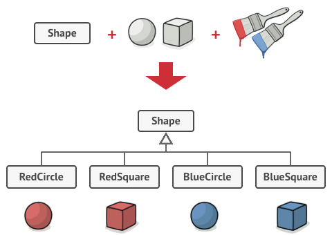
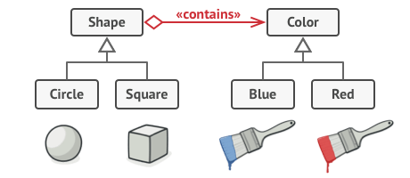
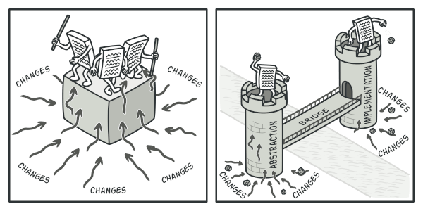
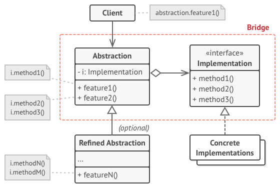
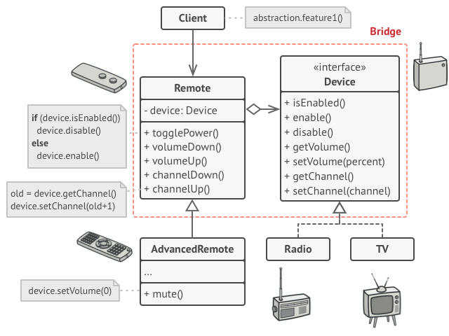

###### [Home](https://github.com/RyKaj/Documentation/blob/master/README.md) | [Software Development](https://github.com/RyKaj/Documentation/tree/master/SoftwareDevelopment/README.md) | [Design Patterns](https://github.com/RyKaj/Documentation/tree/master/SoftwareDevelopment/Design%20Patterns/README.md) |
------------

# Information Technology : Bridge Pattern

## Bridge

<kbd></kbd>

### Intent

**Bridge** is a structural design pattern that lets you split a large
class or a set of closely related classes into two separate
hierarchies—abstraction and implementation—which can be developed
independently of each other.

<kbd></kbd>

### Problem

*Abstraction?* *Implementation?* Sound scary? Stay calm and let’s
consider a simple example.

Say you have a geometric `Shape` class with a pair of subclasses:
`Circle` and `Square`. You want to extend this class hierarchy to
incorporate colors, so you plan to create `Red` and `Blue` shape
subclasses. However, since you already have two subclasses, you’ll need
to create four class combinations such as `BlueCircle` and `RedSquare`.

<kbd></kbd>

Adding new shape types and colors to the hierarchy will grow it
exponentially. For example, to add a triangle shape you’d need to
introduce two subclasses, one for each color. And after that, adding a
new color would require creating three subclasses, one for each shape
type. The further we go, the worse it becomes.

### Solution

This problem occurs because we’re trying to extend the shape classes in
two independent dimensions: by form and by color. That’s a very common
issue with class inheritance.

The Bridge pattern attempts to solve this problem by switching from
inheritance to the object composition. What this means is that you
extract one of the dimensions into a separate class hierarchy, so that
the original classes will reference an object of the new hierarchy,
instead of having all of its state and behaviors within one class.

<kbd></kbd>

Following this approach, we can extract the color-related code into its
own class with two subclasses: `Red` and `Blue`. The `Shape` class then
gets a reference field pointing to one of the color objects. Now the
shape can delegate any color-related work to the linked color object.
That reference will act as a bridge between the `Shape` and `Color`
classes. From now on, adding new colors won’t require changing the shape
hierarchy, and vice versa.

### Abstraction and Implementation

The GoF book introduces the terms *Abstraction* and *Implementation* as
part of the Bridge definition. In my opinion, the terms sound too
academic and make the pattern seem more complicated than it really is.
Having read the simple example with shapes and colors, let’s decipher
the meaning behind the GoF book’s scary words.

*Abstraction* (also called *interface*) is a high-level control layer
for some entity. This layer isn’t supposed to do any real work on its
own. It should delegate the work to the *implementation* layer (also
called *platform*).

Note that we’re not talking about *interfaces* or *abstract classes*
from your programming language. These aren’t the same things.

When talking about real applications, the abstraction can be represented
by a graphical user interface (GUI), and the implementation could be the
underlying operating system code (API) which the GUI layer calls in
response to user interactions.

Generally speaking, you can extend such an app in two independent
directions:

  - Have several different GUIs (for instance, tailored for regular
    customers or admins).
  - Support several different APIs (for example, to be able to launch
    the app under Windows, Linux, and MacOS).

In a worst-case scenario, this app might look like a giant spaghetti
bowl, where hundreds of conditionals connect different types of GUI with
various APIs all over the code.

<kbd></kbd>

You can bring order to this chaos by extracting the code related to
specific interface-platform combinations into separate classes. However,
soon you’ll discover that there are *lots* of these classes. The class
hierarchy will grow exponentially because adding a new GUI or supporting
a different API would require creating more and more classes.

Let’s try to solve this issue with the Bridge pattern. It suggests that
we divide the classes into two hierarchies:

  - Abstraction: the GUI layer of the app.
  - Implementation: the operating systems’ APIs.

<kbd></kbd>

The abstraction object controls the appearance of the app, delegating
the actual work to the linked implementation object. Different
implementations are interchangeable as long as they follow a common
interface, enabling the same GUI to work under Windows and Linux.

As a result, you can change the GUI classes without touching the
API-related classes. Moreover, adding support for another operating
system only requires creating a subclass in the implementation
hierarchy.

### Structure

<kbd></kbd>

### Pseudocode

This example illustrates how the **Bridge** pattern can help divide the
monolithic code of an app that manages devices and their remote
controls. The `Device` classes act as the implementation, whereas the
`Remote`s act as the abstraction.

<kbd></kbd>

The base remote control class declares a reference field that links it
with a device object. All remotes work with the devices via the general
device interface, which lets the same remote support multiple device
types.

You can develop the remote control classes independently from the device
classes. All that’s needed is to create a new remote subclass. For
example, a basic remote control might only have two buttons, but you
could extend it with additional features, such as an extra battery or a
touchscreen.

The client code links the desired type of remote control with a specific
device object via the remote’s constructor.

### Real world example

Consider you have a website with different pages and you are supposed to
allow the user to change the theme. What would you do? Create multiple
copies of each of the pages for each of the themes or would you just
create separate theme and load them based on the user's preferences?
Bridge pattern allows you to do the second i.e.

<https://cloud.githubusercontent.com/assets/11269635/23065293/33b7aea0-f515-11e6-983f-98823c9845ee.png>

### In Plain Words

Bridge pattern is about preferring composition over inheritance.
Implementation details are pushed from a hierarchy to another object
with a separate hierarchy.

### Wikipedia says

The bridge pattern is a design pattern used in software engineering that
is meant to "decouple an abstraction from its implementation so that the
two can vary independently"

### Pros and Cons


<table>
	<thead>
		<tr class="header">
			<th>Pros</th>
			<th>Cons</th>
		</tr>
	</thead>
	<tbody>
		<tr class="odd">
			<td>You can create platform-independent classes and apps.</td>
			<td>You might make the code more complicated by applying the pattern to a highly cohesive class.</td>
		</tr>
		<tr class="even">
			<td>The client code works with high-level abstractions. It isn’t exposed to the platform details.</td>
			<td><br /></td>
		</tr>
		<tr class="odd">
			<td><em>Open/Closed Principle</em>. You can introduce new abstractions and implementations independently from each other.</td>
			<td><br /></td>
		</tr>
		<tr class="even">
			<td><em>Single Responsibility Principle</em>. You can focus on high-level logic in the abstraction and on platform details in the implementation.</td>
			<td><br /></td>
		</tr>
	</tbody>
</table>


#### Programmatic Example

#### C\#


<div id="expander-content-863576251" class="expand-content">

Translating our WebPage example from above. Here we have the 
`WebPage` hierarchy interface

> 
> 
> ``` 
> IWebPage { string GetContent(); 
> } 
> class About : IWebPage { 
>     protected ITheme theme; 
>     public About( ITheme theme) { 
>         this. theme = theme; 
>     } 
>     public string GetContent() { 
>         return $"About page in {
>             theme.GetColor()}"; 
>         } 
>     } 
> class Careers : IWebPage { 
>     protected ITheme theme; 
>     public Careers( ITheme theme) { 
>         this. theme = theme; 
>     } 
>     public string GetContent() { 
>     return $"Careers page in {theme.GetColor()}"; 
>     } 
> }
>                         
> ```

And the separate theme hierarchy

> 
> 
> ``` 
> interface ITheme {
>     string GetColor();
> }
> 
> class DarkTheme : ITheme {
>     public string GetColor() {
>         return "Dark Black";
>     }
> }
> 
> class LightTheme : ITheme {
>     public string GetColor() {
>         return "Off White";
>     }
> }
> 
> class AquaTheme : ITheme {
>     public string GetColor()
>     {
>         return "Light blue";
>     }
> }
>                         
> ```

And both the hierarchies

> 
> 
> ``` 
> var darkTheme = new DarkTheme();
> var lightTheme = new LightTheme();
> 
> var about= new About(darkTheme);
> var careers = new Careers(lightTheme);
> 
> Console.WriteLine(about.GetContent()); //Output: About page in Dark Black
> Console.WriteLine(careers.GetContent()); //Output: Careers page in Off White
>                         
> ```


#### Java


Translating our weapon example from above. Here we have the `Weapon`
hierarchy

``` 
public interface Weapon {
    void wield();
    void swing();
    void unwield();
    Enchantment getEnchantment();
}

public class Sword implements Weapon {
    private final Enchantment enchantment;

    public Sword(Enchantment enchantment) {
        this.enchantment = enchantment;
    }

    @Override
    public void wield() {
        LOGGER.info("The sword is wielded.");
        enchantment.onActivate();
    }

    @Override
    public void swing() {
        LOGGER.info("The sword is swinged.");
        enchantment.apply();
    }

    @Override
    public void unwield() {
        LOGGER.info("The sword is unwielded.");
        enchantment.onDeactivate();
    }

    @Override
    public Enchantment getEnchantment() {
        return enchantment;
    }
}

public class Hammer implements Weapon {
    private final Enchantment enchantment;

    public Hammer(Enchantment enchantment) {
        this.enchantment = enchantment;
    }

    @Override
    public void wield() {
        LOGGER.info("The hammer is wielded.");
        enchantment.onActivate();
    }

    @Override
    public void swing() {
        LOGGER.info("The hammer is swinged.");
        enchantment.apply();
    }

    @Override
    public void unwield() {
        LOGGER.info("The hammer is unwielded.");
        enchantment.onDeactivate();
    }

    @Override
    public Enchantment getEnchantment() {
        return enchantment;
    }
}
                    
```

And the separate enchantment hierarchy

``` 
public interface Enchantment {
    void onActivate();
    void apply();
    void onDeactivate();
}

public class FlyingEnchantment implements Enchantment {
    @Override
    public void onActivate() {
        LOGGER.info("The item begins to glow faintly.");
    }

    @Override
    public void apply() {
        LOGGER.info("The item flies and strikes the enemies finally returning to owner's hand.");
    }

    @Override
    public void onDeactivate() {
        LOGGER.info("The item's glow fades.");
    }
}

public class SoulEatingEnchantment implements Enchantment {
    @Override
    public void onActivate() {
        LOGGER.info("The item spreads bloodlust.");
    }

    @Override
    public void apply() {
        LOGGER.info("The item eats the soul of enemies.");
    }

    @Override
    public void onDeactivate() {
        LOGGER.info("Bloodlust slowly disappears.");
    }
}
                    
```

And both the hierarchies in action

``` 
Sword enchantedSword = new Sword(new SoulEatingEnchantment());
enchantedSword.wield();
enchantedSword.swing();
enchantedSword.unwield();
// The sword is wielded.
// The item spreads bloodlust.
// The sword is swinged.
// The item eats the soul of enemies.
// The sword is unwielded.
// Bloodlust slowly disappears.

Hammer hammer = new Hammer(new FlyingEnchantment());
hammer.wield();
hammer.swing();
hammer.unwield();
// The hammer is wielded.
// The item begins to glow faintly.
// The hammer is swinged.
// The item flies and strikes the enemies finally returning to owner's hand.
// The hammer is unwielded.
// The item's glow fades.
                    
```


#### JavaScript


Translating our WebPage example from above. Here we have the `WebPage`
hierarchy

``` 
/*
Webpage interface :
constructor(theme)
getContent()
*/

class About{ 
    constructor(theme) {
        this.theme = theme
    }

    getContent() {
        return "About page in " + this.theme.getColor()
    }
}

class Careers{
    constructor(theme) {
        this.theme = theme
    }
   
    getContent() {
        return "Careers page in " + this.theme.getColor()
    } 
}
                    
```

And the separate theme hierarchy

``` 
/*
Theme interface :

getColor()
*/

class DarkTheme{
    getColor() {
        return 'Dark Black'
    }
}
class LightTheme{
    getColor() {
        return 'Off white'
    }
}
class AquaTheme{
    getColor() {
        return 'Light blue'
    }
}
                    
```

And both the hierarchies

``` 
const darkTheme = new DarkTheme()

const about = new About(darkTheme)
const careers = new Careers(darkTheme)

console.log(about.getContent() )// "About page in Dark Black"
console.log(careers.getContent() )// "Careers page in Dark Black"
                    
```


#### PHP


``` 
interface WebPage {  
    public function __construct(Theme $theme);  
    public function getContent(); 
} 
class About implements WebPage {  
    protected $theme;  
    public function __construct(Theme $theme)  {  
        $this->theme = $theme;  
    }  
    public function getContent()  {  
        return "About page in " . $this->theme->getColor();  
    } 
} 
class Careers implements WebPage {  
    protected $theme;  
    public function __construct(Theme $theme)  {  
        $this->theme = $theme;  
    }  
    public function getContent()  {  
        return "Careers page in " . $this->theme->getColor();  
    } 
}
                    
```

And the separate theme hierarchy

``` 
interface Theme {
    public function getColor();
}

class DarkTheme implements Theme {
    public function getColor() {
        return 'Dark Black';
    }
}
class LightTheme implements Theme {
    public function getColor() {
        return 'Off white';
    }
}
class AquaTheme implements Theme {
    public function getColor() {
        return 'Light blue';
    }
}
                    
```

And both the hierarchies

``` 
$darkTheme = new DarkTheme();

$about = new About($darkTheme);
$careers = new Careers($darkTheme);

echo $about->getContent(); // "About page in Dark Black";
echo $careers->getContent(); // "Careers page in Dark Black";
                    
```


#### Python


``` 
#!/usr/bin/env python
# -*- coding: utf-8 -*-

"""
*References:
http://en.wikibooks.org/wiki/Computer_Science_Design_Patterns/Bridge_Pattern#Python

*TL;DR
Decouples an abstraction from its implementation.
"""

# ConcreteImplementor 1/2
class DrawingAPI1(object):
    def draw_circle(self, x, y, radius):
        print('API1.circle at {}:{} radius {}'.format(x, y, radius))

# ConcreteImplementor 2/2
class DrawingAPI2(object):
    def draw_circle(self, x, y, radius):
        print('API2.circle at {}:{} radius {}'.format(x, y, radius))

# Refined Abstraction
class CircleShape(object):
    def __init__(self, x, y, radius, drawing_api):
        self._x = x
        self._y = y
        self._radius = radius
        self._drawing_api = drawing_api

    # low-level i.e. Implementation specific
    def draw(self):
        self._drawing_api.draw_circle(self._x, self._y, self._radius)

    # high-level i.e. Abstraction specific
    def scale(self, pct):
        self._radius *= pct

def main():
    shapes = (CircleShape(1, 2, 3, DrawingAPI1()), CircleShape(5, 7, 11, DrawingAPI2()))

    for shape in shapes:
        shape.scale(2.5)
        shape.draw()

if __name__ == '__main__':
    main()

### OUTPUT ###
# API1.circle at 1:2 radius 7.5
# API2.circle at 5:7 radius 27.5
                    
```


