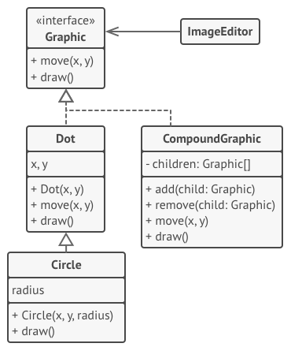

###### [Home](https://github.com/RyKaj/Documentation/blob/master/README.md) | [Software Development](https://github.com/RyKaj/Documentation/tree/master/SoftwareDevelopment/README.md) | [Design Patterns](https://github.com/RyKaj/Documentation/tree/master/SoftwareDevelopment/Design%20Patterns/README.md) |
------------

# Information Technology : Composite Pattern


## Composite

<kbd></kbd>

### Intent

**Composite** is a structural design pattern that lets you compose
objects into tree structures and then work with these structures as if
they were individual objects.

<kbd></kbd>

### Problem

Using the Composite pattern makes sense only when the core model of your
app can be represented as a tree.

For example, imagine that you have two types of objects: `Products` and
`Boxes`. A `Box` can contain several `Products` as well as a number of
smaller `Boxes`. These little `Boxes` can also hold some `Products` or
even smaller `Boxes`, and so on.

Say you decide to create an ordering system that uses these classes.
Orders could contain simple products without any wrapping, as well as
boxes stuffed with products...and other boxes. How would you determine
the total price of such an order?

<kbd></kbd>

You could try the direct approach: unwrap all the boxes, go over all the
products and then calculate the total. That would be doable in the real
world; but in a program, it’s not as simple as running a loop. You have
to know the classes of `Products` and `Boxes` you’re going through, the
nesting level of the boxes and other nasty details beforehand. All of
this makes the direct approach either too awkward or even impossible.

### Solution

The Composite pattern suggests that you work with `Products` and `Boxes`
through a common interface which declares a method for calculating the
total price.

How would this method work? For a product, it’d simply return the
product’s price. For a box, it’d go over each item the box contains, ask
its price and then return a total for this box. If one of these items
were a smaller box, that box would also start going over its contents
and so on, until the prices of all inner components were calculated. A
box could even add some extra cost to the final price, such as packaging
cost.

<kbd></kbd>

The greatest benefit of this approach is that you don’t need to care
about the concrete classes of objects that compose the tree. You don’t
need to know whether an object is a simple product or a sophisticated
box. You can treat them all the same via the common interface. When you
call a method, the objects themselves pass the request down the tree.

### Structure

<kbd></kbd>

### Pseudocode

In this example, the **Composite** pattern lets you implement stacking
of geometric shapes in a graphical editor.

<kbd></kbd>

The `CompoundGraphic` class is a container that can comprise any number
of sub-shapes, including other compound shapes. A compound shape has the
same methods as a simple shape. However, instead of doing something on
its own, a compound shape passes the request recursively to all its
children and “sums up” the result.

The client code works with all shapes through the single interface
common to all shape classes. Thus, the client doesn’t know whether it’s
working with a simple shape or a compound one. The client can work with
very complex object structures without being coupled to concrete classes
that form that structure.

### Real world example

Every organization is composed of employees. Each of the employees has
the same features i.e. has a salary, has some responsibilities, may or
may not report to someone, may or may not have some subordinates etc.

### In plain words

Composite pattern lets clients treat the individual objects in a uniform
manner.

### Wikipedia says

In software engineering, the composite pattern is a partitioning design
pattern. The composite pattern describes that a group of objects is to
be treated in the same way as a single instance of an object. The intent
of a composite is to "compose" objects into tree structures to represent
part-whole hierarchies. Implementing the composite pattern lets clients
treat individual objects and compositions uniformly.

### Pros and Cons


<table>
    <thead>
        <tr class="header">
            <th>Pros</th>
            <th>Cons</th>
        </tr>
    </thead>
    <tbody>
        <tr class="odd">
            <td>You can work with complex tree structures more conveniently: use polymorphism and recursion to your advantage.</td>
            <td>It might be difficult to provide a common interface for classes whose functionality differs too much. In certain scenarios, you’d need to overgeneralize the component interface, making it harder to comprehend.</td>
        </tr>
        <tr class="even">
            <td><em>Open/Closed Principle</em>. You can introduce new element types into the app without breaking the existing code, which now works with the object tree.</td>
            <td><br /></td>
        </tr>
    </tbody>
</table>


### Programmatic Example

Taking our employees example from above. Here we have different employee
types

#### C\#


> 
> 
> ``` 
> 
> interface IEmployee
> {
>     float GetSalary();
>     string GetRole();
>     string GetName();
> }
> 
> class Developer : IEmployee {
>     private string mName;
>     private float mSalary;
> 
>     public Developer(string name, float salary) {
>         this.mName = name;
>         this.mSalary = salary;
>     }
> 
>     public float GetSalary() {
>         return this.mSalary;
>     }
> 
>     public string GetRole() {
>         return "Developer";
>     }
> 
>     public string GetName() {
>         return this.mName;
>     }
> }
> 
> class Designer : IEmployee {
>     private string mName;
>     private float mSalary;
> 
>     public Designer(string name, float salary) {
>         this.mName = name;
>         this.mSalary = salary;
>     }
> 
>     public float GetSalary() {
>         return this.mSalary;
>     }
> 
>     public string GetRole() {
>         return "Designer";
>     }
> 
>     public string GetName() {
>         return this.mName;
>     }
> }
>                     
> ```

Then we have an organization which consists of several different types
of employees

> 
> 
> ``` 
> class Organization {
>     protected List <IEmployee> employees;
> 
>     public Organization() {
>         employees = new List<IEmployee>();
>     }
> 
>     public void AddEmployee(IEmployee employee) {
>         employees.Add(employee);
>     }
> 
>     public float GetNetSalaries() {
>         float netSalary = 0;
> 
>         foreach (var e in employees) {
>             netSalary += e.GetSalary();
>         }
>         return netSalary;
>     }
> }
>                     
> ```

And then it can be used as

> 
> 
> ``` 
> //Arrange Employees, Organization and add employees
> var developer = new Developer("John", 5000);
> var designer = new Designer("Arya", 5000);
> 
> var organization = new Organization();
> organization.AddEmployee(developer);
> organization.AddEmployee(designer);
> 
> Console.WriteLine($"Net Salary of Employees in Organization is {organization.GetNetSalaries():c}");
> //Ouptut: Net Salary of Employees in Organization is $10000.00
>                     
> ```


#### Java


Taking our sentence example from above. Here we have the base class and
different printable types

``` 
public abstract class LetterComposite {
    private List <LetterComposite> children = new ArrayList<>();
    public void add(LetterComposite letter) {
        children.add(letter);
    }
    public int count() {
        return children.size();
    }
    protected void printThisBefore() {}
    protected void printThisAfter() {}
    public void print() {
        printThisBefore();
        for (LetterComposite letter : children) {
            letter.print();
        }
        printThisAfter();
    }
}

public class Letter extends LetterComposite {
    private char c;
    public Letter(char c) {
        this.c = c;
    }
    @Override
    protected void printThisBefore() {
        System.out.print(c);
    }
}

public class Word extends LetterComposite {
    public Word(List<Letter> letters) {
        for (Letter l : letters) {
            this.add(l);
        }
    }
    @Override
    protected void printThisBefore() {
        System.out.print(" ");
    }
}

public class Sentence extends LetterComposite {
    public Sentence(List<Word> words) {
        for (Word w : words) {
            this.add(w);
        }
    }
    @Override
    protected void printThisAfter() {
        System.out.print(".");
    }
}
                
```

Then we have a messenger to carry messages

``` 
public class Messenger {
    LetterComposite messageFromOrcs() {
        List<Word> words = new ArrayList<>();
        words.add(new Word(Arrays.asList(new Letter('W'), new Letter('h'), new Letter('e'), new Letter('r'), new Letter('e'))));
        words.add(new Word(Arrays.asList(new Letter('t'), new Letter('h'), new Letter('e'), new Letter('r'), new Letter('e'))));
        words.add(new Word(Arrays.asList(new Letter('i'), new Letter('s'))));
        words.add(new Word(Arrays.asList(new Letter('a'))));
        words.add(new Word(Arrays.asList(new Letter('w'), new Letter('h'), new Letter('i'), new Letter('p'))));
        words.add(new Word(Arrays.asList(new Letter('t'), new Letter('h'), new Letter('e'), new Letter('r'), new Letter('e'))));
        words.add(new Word(Arrays.asList(new Letter('i'), new Letter('s'))));
        words.add(new Word(Arrays.asList(new Letter('a'))));
        words.add(new Word(Arrays.asList(new Letter('w'), new Letter('a'), new Letter('y'))));
        return new Sentence(words);
    }

    LetterComposite messageFromElves() {
        List<Word> words = new ArrayList<>();
        words.add(new Word(Arrays.asList(new Letter('M'), new Letter('u'), new Letter('c'), new Letter('h'))));
        words.add(new Word(Arrays.asList(new Letter('w'), new Letter('i'), new Letter('n'), new Letter('d'))));
        words.add(new Word(Arrays.asList(new Letter('p'), new Letter('o'), new Letter('u'), new Letter('r'), new Letter('s'))));
        words.add(new Word(Arrays.asList(new Letter('f'), new Letter('r'), new Letter('o'), new Letter('m'))));
        words.add(new Word(Arrays.asList(new Letter('y'), new Letter('o'), new Letter('u'), new Letter('r'))));
        words.add(new Word(Arrays.asList(new Letter('m'), new Letter('o'), new Letter('u'), new Letter('t'), new Letter('h'))));
        return new Sentence(words);
    }
}
                
```

And then it can be used as

``` 
LetterComposite orcMessage = new Messenger().messageFromOrcs();
orcMessage.print(); // Where there is a whip there is a way.
LetterComposite elfMessage = new Messenger().messageFromElves();
elfMessage.print(); // Much wind pours from your mouth.
                
```


#### JavaScript


Taking our employees example from above. Here we have different employee
types

``` 
/*
Employee interface :

constructor(name, salary)
getName()
setSalary()
getSalary()
getRoles()
*/

class Developer {
    constructor(name, salary) {
        this.name = name
        this.salary = salary
    }

    getName() {
        return this.name
    }

    setSalary(salary) {
        this.salary = salary
    }

    getSalary() {
        return this.salary
    }

    getRoles() {
        return this.roles
    }

    develop() {
        /* */
    }
}

class Designer {

    constructor(name, salary) {
        this.name = name
        this.salary = salary
    }

    getName() {
        return this.name
    }

    setSalary(salary) {
        this.salary = salary
    }

    getSalary() {
        return this.salary
    }

    getRoles() {
        return this.roles
    }

    design() {
        /* */
    }
}
                
```

Then we have an organization which consists of several different types
of employees

``` 
class Organization {
    constructor(){
        this.employees = []
    }

    addEmployee(employee) {
        this.employees.push(employee)
    }

    getNetSalaries() {
        let netSalary = 0

        this.employees.forEach(employee => {
            netSalary += employee.getSalary()
        })

        return netSalary
    }
}

                
```

And then it can be used as

``` 
// Prepare the employees
const john = new Developer('John Doe', 12000)
const jane = new Designer('Jane', 10000)

// Add them to organization
const organization = new Organization()
organization.addEmployee(john)
organization.addEmployee(jane)

console.log("Net salaries: " , organization.getNetSalaries()) // Net Salaries: 22000
                
```


#### PHP


``` 
interface Employee
{
    public function __construct(string $name, float $salary);
    public function getName(): string;
    public function setSalary(float $salary);
    public function getSalary(): float;
    public function getRoles(): array;
}

class Developer implements Employee
{
    protected $salary;
    protected $name;
    protected $roles;
 
    public function __construct(string $name, float $salary) {
        $this->name = $name;
        $this->salary = $salary;
    }

    public function getName(): string {
        return $this->name;
    }

    public function setSalary(float $salary) {
        $this->salary = $salary;
    }

    public function getSalary(): float {
        return $this->salary;
    }

    public function getRoles(): array {
        return $this->roles;
    }
}

class Designer implements Employee
{
    protected $salary;
    protected $name;
    protected $roles;

    public function __construct(string $name, float $salary)
    {
        $this->name = $name;
        $this->salary = $salary;
    }

    public function getName(): string
    {
        return $this->name;
    }

    public function setSalary(float $salary)
    {
        $this->salary = $salary;
    }

    public function getSalary(): float
    {
        return $this->salary;
    }

    public function getRoles(): array
    {
        return $this->roles;
    }
}
                
```

Then we have an organization which consists of several different types
of employees

``` 
class Organization
{
    protected $employees;

    public function addEmployee(Employee $employee) {
        $this->employees[] = $employee;
    }

    public function getNetSalaries(): float {
        $netSalary = 0;

        foreach ($this->employees as $employee) {
            $netSalary += $employee->getSalary();
        }

        return $netSalary;
    }
}
                
```

Then we have an organization which consists of several different types
of employees

``` 
// Prepare the employees
$john = new Developer('John Doe', 12000);
$jane = new Designer('Jane Doe', 15000);

// Add them to organization
$organization = new Organization();
$organization->addEmployee($john);
$organization->addEmployee($jane);

echo "Net salaries: " . $organization->getNetSalaries(); // Net Salaries: 27000
                
```


#### Python


``` 
#!/usr/bin/env python
# -*- coding: utf-8 -*-

"""
*What is this pattern about?
The composite pattern describes a group of objects that is treated the
same way as a single instance of the same type of object. The intent of
a composite is to "compose" objects into tree structures to represent
part-whole hierarchies. Implementing the composite pattern lets clients
treat individual objects and compositions uniformly.

*What does this example do?
The example implements a graphic class，which can be either an ellipse
or a composition of several graphics. Every graphic can be printed.

*Where is the pattern used practically?
In graphics editors a shape can be basic or complex. An example of a
simple shape is a line, where a complex shape is a rectangle which is
made of four line objects. Since shapes have many operations in common
such as rendering the shape to screen, and since shapes follow a
part-whole hierarchy, composite pattern can be used to enable the
program to deal with all shapes uniformly.

*References:
https://en.wikipedia.org/wiki/Composite_pattern
https://infinitescript.com/2014/10/the-23-gang-of-three-design-patterns/

*TL;DR
Describes a group of objects that is treated as a single instance.
"""

class Graphic:
    def render(self):
        raise NotImplementedError("You should implement this.")

class CompositeGraphic(Graphic):
    def __init__(self):
        self.graphics = []

    def render(self):
        for graphic in self.graphics:
            graphic.render()

    def add(self, graphic):
        self.graphics.append(graphic)

    def remove(self, graphic):
        self.graphics.remove(graphic)


class Ellipse(Graphic):
    def __init__(self, name):
        self.name = name

    def render(self):
        print("Ellipse: {}".format(self.name))

if __name__ == '__main__':
    ellipse1 = Ellipse("1")
    ellipse2 = Ellipse("2")
    ellipse3 = Ellipse("3")
    ellipse4 = Ellipse("4")

    graphic1 = CompositeGraphic()
    graphic2 = CompositeGraphic()

    graphic1.add(ellipse1)
    graphic1.add(ellipse2)
    graphic1.add(ellipse3)
    graphic2.add(ellipse4)

    graphic = CompositeGraphic()

    graphic.add(graphic1)
    graphic.add(graphic2)

    graphic.render()

### OUTPUT ###
# Ellipse: 1
# Ellipse: 2
# Ellipse: 3
# Ellipse: 4    
                
```

